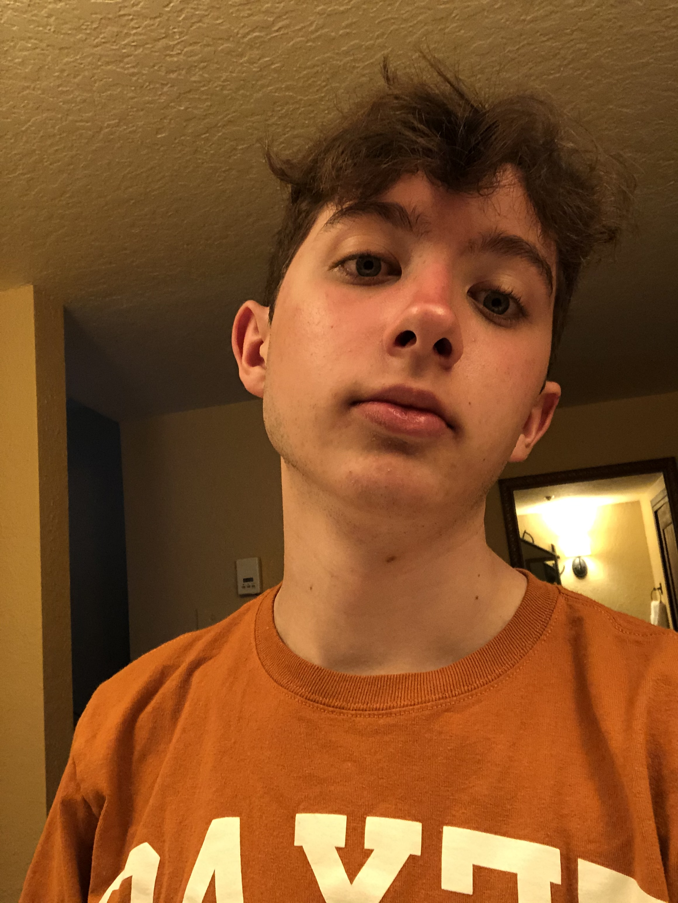

## About Me:
 
Currently a Computer Science Junior at the University of Texas at Austin with a focus in networking. 
Proficient in Java, C, C++, and Python. I'm familiar with both front-end and back-end development. 
Seeking out an internship in either the Austin or Houston area for the summer of 2023.

## Projects:

- [X] [GitHub Website](https://github.com/jimbo23000/jimbo23000.github.io)
